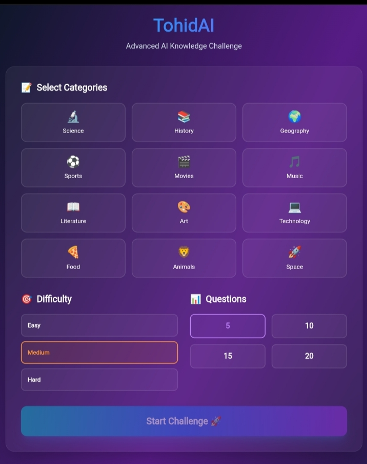

# 🧠 TohidAI - Advanced Knowledge Challenge


**TohidAI** is an interactive and modern quiz application designed to test your knowledge across various domains. With a sleek UI and customizable difficulty settings, users can challenge themselves in topics ranging from Science and History to Movies and Space.

🔗 **Live Demo:** [https://tohidgame.vercel.app](https://tohidgame.vercel.app)

## 📸 Screenshots

 
*(Note: Upload a screenshot of your app to the public folder for this image to show)*

## ✨ Features

- **📂 Multiple Categories:** Choose from 12+ topics including Science, History, Technology, Sports, and Art.
- **🎚️ Customizable Difficulty:** Select between **Easy**, **Medium**, and **Hard** modes to suit your expertise.
- **🔢 Question Control:** Users can decide the length of the quiz (5, 10, 15, or 20 questions).
- **🎨 Modern UI:** Built with a responsive and dark-themed design using **Tailwind CSS**.
- **🚀 Fast Performance:** Hosted on Vercel for lightning-fast load times.

## 🛠️ Tech Stack

- **Frontend:** JavaScript (React/Vanilla), HTML5
- **Styling:** Tailwind CSS, PostCSS
- **Deployment:** Vercel
- **Package Manager:** NPM

## 🚀 How to Run Locally

Follow these steps to run the project on your local machine:

1. **Clone the repository**
   ```bash
   git clone [https://github.com/Tohidkhan6332/tohidgame.git](https://github.com/Tohidkhan6332/tohidgame.git)
   
